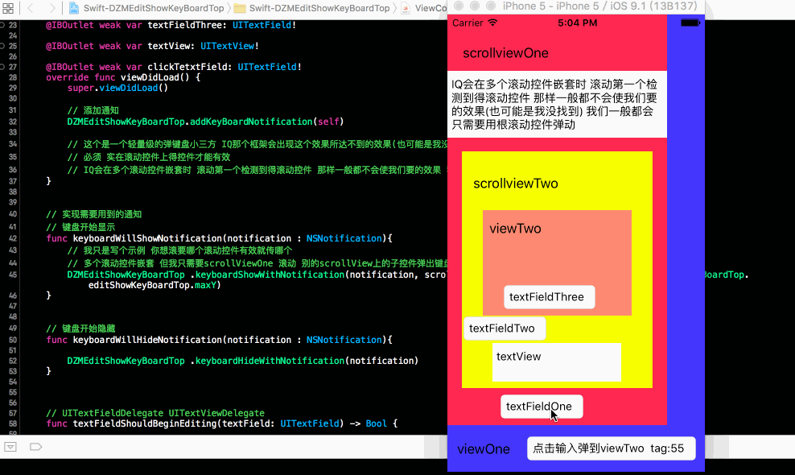
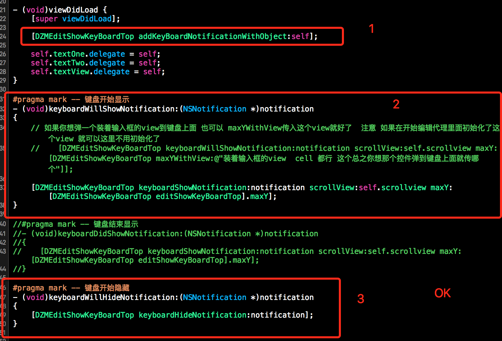
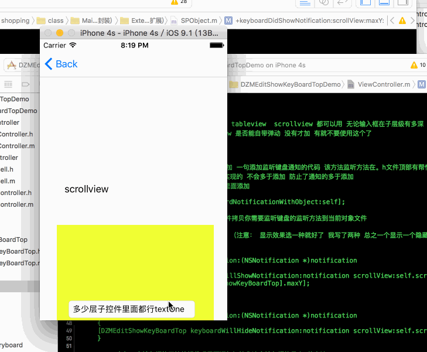

# OC-DZMEditShowKeyBoardTop
介绍:将一个文本框或者一个空间弹动到键盘之上 本框架比IQKeyboardManager(简写IQ) 有一个优势 当多个滚动控件嵌套时 IQ会滚动它检测到的第一个滚动控件 但是DZMEditShowKeyBoardTop不会 你可以任意选择你需要支持弹动滚动控件 ScollView TbaleView CollectionView 能滚动即可 实现简单 可以任意修改或者自行添加runtime机制 注释明确 

# Swift版本 Swift-DZMEditShowKeyBoardTop
https://github.com/dengzemiao/Swift-DZMEditShowKeyBoardTop

##实现代码

// 添加通知
- (void)viewDidLoad {
[super viewDidLoad];

[DZMEditShowKeyBoardTop addKeyBoardNotificationWithObject:self];
}

// 显示的任选一种就行了
// 键盘开始显示
- (void)keyboardWillShowNotification:(NSNotification *)notification
{
[DZMEditShowKeyBoardTop keyboardShowNotification:notification scrollView:self.scrollview maxY:[DZMEditShowKeyBoardTop editShowKeyBoardTop].maxY];
}

// 键盘结束显示
//- (void)keyboardDidShowNotification:(NSNotification *)notification
//{
//    [DZMEditShowKeyBoardTop keyboardShowNotification:notification scrollView:self.scrollview maxY:[DZMEditShowKeyBoardTop editShowKeyBoardTop].maxY];
//}

// 键盘开始隐藏
- (void)keyboardWillHideNotification:(NSNotification *)notification
{
[DZMEditShowKeyBoardTop keyboardHideNotification:notification];
}

// 在你需要的支持弹动的textField 开始展示编辑代理中加上一句
[DZMEditShowKeyBoardTop maxYWithView:textView];
//或者
[DZMEditShowKeyBoardTop maxYWithView:self];
//或者.... 只要是个你想在键盘出来的时候弹到键盘之上的即可

// 例如：
// UITextViewDelegate
- (BOOL)textViewShouldBeginEditing:(UITextView *)textView
{
[DZMEditShowKeyBoardTop maxYWithView:textView];
return YES;
}

// UITextFieldDelegate
- (BOOL)textFieldShouldBeginEditing:(UITextField *)textField
[DZMEditShowKeyBoardTop maxYWithView:textField];
return YES;
}
--------------------------------------------------------------------------------------------------------------

##代码实现图

--------------------------------------------------------------------------------------------------------------

##期待
* 如果在使用过程中遇到BUG，希望你能Issues我，谢谢!
* 如果在使用过程中发现功能不够用，希望你能Issues我.